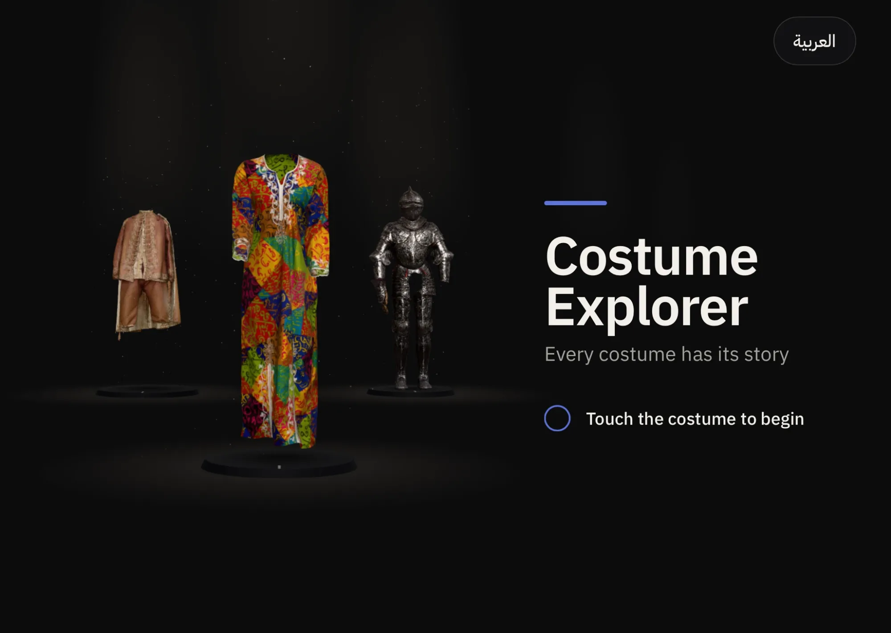
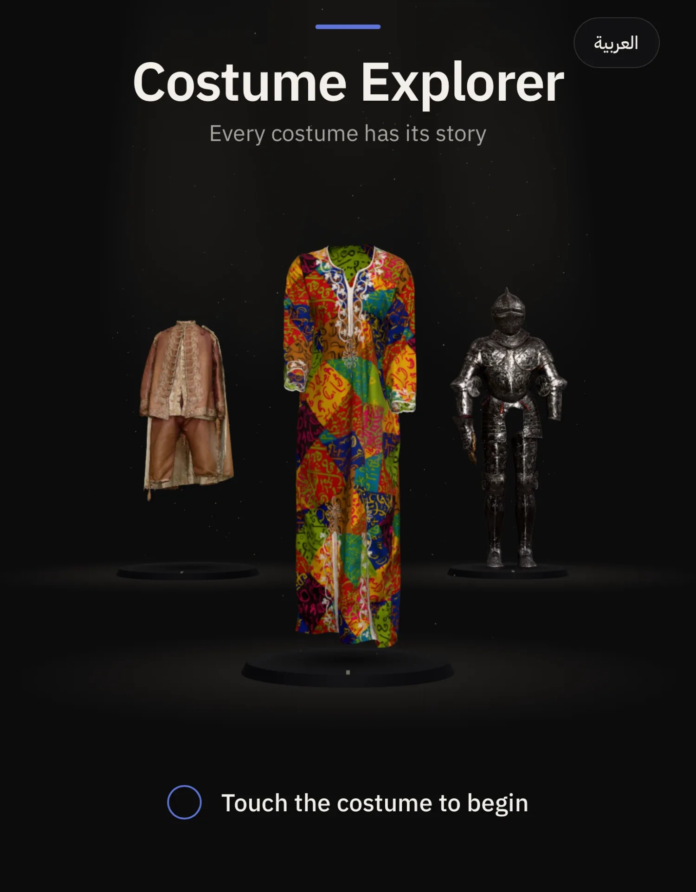

# Costume Explorer

A touch-first exhibition page for an iPad kiosk. Three very different costumes stand on one dark revolving stage. Visitors turn a costume on its turntable, tap hotspots on the garment, and read about its material, how it was made and its artistry, in English or Arabic.

- **Live:** https://costume-explorer.vercel.app (Safari on iPad; add it to the Home Screen to run it full screen)
- **Repository:** https://github.com/RK239/costume-explorer

## The attract state





## Design rationale

1. One dark stage, not three pages: the costumes stand on a revolving stage, the one being explored in front and the other two dimly lit behind it, so the visitor always sees there's more, and a swipe or a tap brings the next one forward.
2. The visitor turns the costume, like a turntable in a gallery; the camera belongs to a "director" that frames every shot and never orbits, so the costume is always composed and readable.
3. Every camera, light and panel move is one GSAP timeline with eased curves, and input waits while it runs, so nothing snaps or fights the finger.
4. The attract state is one continuous take on the stage: each costume comes round, turns to show its back (where a ring pulses on the hidden hotspot) and returns, while the camera breathes in and out and all three stay in frame.
5. Hotspots are fine hollow rings the detail shows through, with the label as type on the image, turned away from the garment; they fade with the angle, so the back ones appear only when the visitor turns the costume.
6. A tap turns that detail to the visitor and pushes in to a medium shot while the close-up grows out of the ring into the story panel: the image is the moment of leaning in.
7. The panel never covers the costume: the camera shifts its lens so the costume stands beside the panel, and the push-in stops at a medium shot.
8. One type system (IBM Plex Sans and IBM Plex Sans Arabic) and one layout for all three costumes; only the accent changes, a colour sampled from each garment.
9. Arabic is composed, not mirrored: the headline and panel move to the left and the costume to the right, the type is larger with more line height and Eastern Arabic digits, and the dress is titled «فستان الحروف», "the dress of letters", because its letters spell nothing; the costumes, their labels and the camera moves stay as they are.
10. It's built for a kiosk: touch only, 60 px touch targets, no zoom, scroll or text selection, and after 45 s with no touch the stage resets for the next visitor.

## My calls

- **Hotspot style:** a fine hollow ring with a point at its centre, so the detail stays visible through it. The label sits on the side away from the garment, on a hairline leader, as type on the image with a soft halo and no plate (28 px). It draws out only while its detail faces the visitor, and every hotspot fades with its angle to the camera. *Rejected:* solid pins, which cover the detail, and labels on plates, which looked like boxes stuck on the costume.
- **Long-story behaviour:** three short chapters (Material, How it was made, The artistry), about two lines each, tapped through as tabs under the close-up. Nothing scrolls. The costume keeps turning while the story is open, and a tap on another ring swaps the story in place. *Rejected:* a scrolling panel, which fights the touch lock and reads badly at 1.5 m.
- **Seen points and costumes:** an opened hotspot's ring fills with the costume's accent, and each costume's button shows "n of 4 found". When every hotspot on a costume is found, the next unfinished costume's button pulses gently. The first time a back hotspot turns into view, its ring blooms once. Home and the 45 s idle return clear everything: they mean a new visitor.
- **A very fast spin:** the turntable keeps its momentum and slows down, with its speed capped at about 1.6 turns a second. Above a threshold the labels hide, and they come back once it settles. Auto-rotate eases back in 3 s after the last touch. *Rejected:* snapping to the nearest side, which takes control away from the visitor.
- **All three together:** always. In the attract state the whole group is in every shot, because a passer-by who sees several costumes is more likely to come closer. While exploring, the two not in front stand dimly behind the one being explored, showing the way to them. In a story they go dark, so nothing competes with the reading.

## Creative extra: subtle idle motion and light

Each costume stands in a shaft of light through haze, with dust drifting in it and faint shafts far behind for depth. The light follows each costume as the stage turns: the one arriving at the front comes up, and the one leaving dims as it goes upstage. In the attract state each costume's light swells as the camera closes in on it. All of it is unlit and additive, so it costs no extra lights on the iPad.

A guided hotspot tour was planned as the creative extra and cut for time.

## An AI idea I rejected

First-time users found it hard to switch between the costumes. The AI proposed showing a glimpse of the neighbouring costumes at the edges of the frame, each with a name tag ("Calligraphy Dress ›") to tap. I rejected it on design grounds: costumes cut off by the frame, with tags at the edges, would look odd in the composition. Instead, the other two costumes stand dimly lit on the stage behind the one being explored, on a revolving stage that a swipe turns. The composition stays whole, and the costumes themselves show there's more.

Every decision, with the alternative we rejected, is logged in [docs/DECISIONS.md](docs/DECISIONS.md), including the other AI suggestions I rejected.

## Model credits

| Costume | Model | Licence | What we changed |
|---|---|---|---|
| The National Costume | [The National Costume](https://sketchfab.com/3d-models/the-national-costume-3bbd0a12d98d4c66849486c61b7a8694), The Royal Armoury (Livrustkammaren), Stockholm; scan by Erik Lernestål | [CC BY-SA 4.0](https://creativecommons.org/licenses/by-sa/4.0/) | A hole in the cape's lining patched with a new piece of lining in Blender; turned to face front, scaled to an estimated real height and centred; stray texture coordinates clamped; simplified from 500k to ~117k triangles; the 4K texture resized to 2K and converted to WebP; geometry compressed with meshopt. Our optimised copy (`public/models/national-costume.glb`) is shared under CC BY-SA 4.0, as the licence requires. |
| The Parade Armour of King Erik XIV | [The Parade Armour of King Erik XIV of Sweden](https://sketchfab.com/3d-models/the-parade-armour-of-king-erik-xiv-of-sweden-bd189bba7d9e4924b12826a6d68200d9), The Royal Armoury (Livrustkammaren), Stockholm | [CC BY 4.0](https://creativecommons.org/licenses/by/4.0/) | Turned to face front and centred; simplified from 1M to ~450k triangles; the 4K texture resized to 2K and converted to WebP; geometry compressed with meshopt. |
| The Calligraphy Dress | [100 follower TY! [Arabic Calligraphy Dress]](https://sketchfab.com/3d-models/100-follower-ty-arabic-calligraphy-dress-a5e08f6b2941447abb56076c81111408), Taylor (thoulihan), scanned with an Artec Leo | [CC BY 4.0](https://creativecommons.org/licenses/by/4.0/) | Stood upright, scaled from millimetres to metres and centred under the skirt; simplified from 463k to ~116k triangles; the 4K texture resized to 2K and converted to WebP; geometry compressed with meshopt. |

The full record of changes per model is in [scripts/models.config.json](scripts/models.config.json).

## Content disclosure

- **The hotspot stories are invented but believable, and written by AI.** All twelve (Material, How it was made, The artistry), their labels and the image descriptions were written by Claude, the AI pair on this project, from what the scans show and from the sources. They haven't been checked against the sources. The facts they build on come from the sources:
  - the National Costume and the armour: the Royal Armoury's descriptions (Gustav III's national costume, worn by him on 24 April 1778; Erik XIV's parade armour, around 1562);
  - the dress: its owner's note on Sketchfab (a cotton dress, a gift from a Turkish friend, worn at home for prayer in summer). Its letters are decorative and spell nothing.
- **"The Calligraphy Dress" is our title** for that model.
- **The story images are renders, not photographs.** Each close-up was rendered in Blender from the scanned model.
- **The Arabic was translated by AI** (Claude) and hasn't been proofread by a native speaker.

## Performance and testing

- Tested in Safari on an iPad (5th generation), in portrait and landscape.
- First visit, on Wi-Fi in a fresh private tab: the attract state appears in about 2 s.
- All three models load in parallel at the start, about 8 MB together, so switching costumes never waits or flashes blank. They're optimised by `npm run models` (gltf-transform and meshoptimizer): simplified, 2K WebP textures, meshopt-compressed geometry.
- The pixel ratio is capped at 2. There are no shadow maps (soft contact shadows instead) and no post-processing.
- Touch lock: no pinch or double-tap zoom, no pull-to-refresh or page scroll, no text selection or long-press menu, and no hover styles anywhere.

## Run it

```bash
npm install
npm run dev -- --host
```

`npm run build` makes the production build. URL flags for testing:

- `?idle=5`: return to the attract state after 5 s instead of 45.
- `?dev=1`: frame rate, load progress, and a tap on a costume logs the hotspot position.
- `?focus=0`, `1` or `2`: skip the attract state and open a costume.

The raw scans aren't in the repository; `npm run models` needs them in `models-src/`.

## How it's built

Vite and vanilla JavaScript, [three.js](https://threejs.org) for the stage and [GSAP](https://gsap.com) for every move. All copy, in both languages, and the hotspot data live in `src/content.json`. It was built with Claude Code as an AI pair programmer. [CLAUDE.md](CLAUDE.md) holds the working rules, and the `docs` folder holds the [architecture](docs/ARCHITECTURE.md), the [build plan](docs/PLAN.md) and the [decision log](docs/DECISIONS.md).
